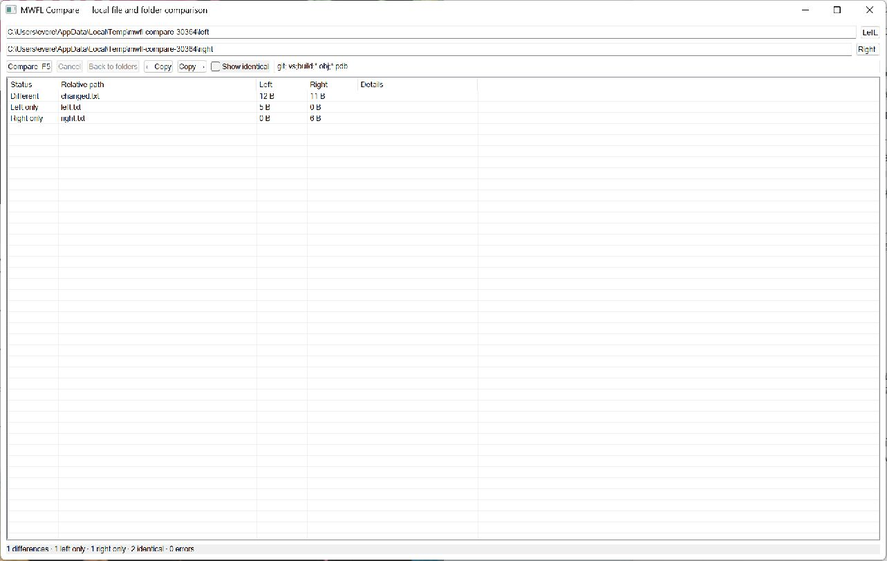

# Folder Compare

[](https://github.com/mwfl/folder-compare/actions/workflows/ci.yml)

Folder Compare is a native, local-first Windows application for comparing directory trees and individual text files. It performs comparisons on a worker thread, previews text changes side by side, and uses explicitly confirmed, byte-verified copies.



## Features

- Recursive folder comparison with exclusions and cancellation.
- Exact content verification rather than trusting timestamps.
- Same, changed, left-only, right-only, type-conflict, and error states.
- Virtual result list suitable for large directory trees.
- Side-by-side bounded text diff with binary detection and final-newline reporting.
- Explicit left-to-right and right-to-left copy operations.
- Sibling temporary files, byte verification, and write-through replacement.
- Symbolic links are compared but never followed implicitly.

## Build

```powershell
cmake --preset vs2026-x64
cmake --build --preset vs2026-x64-release
ctest --preset vs2026-x64-release
```

Visual Studio 2022 is supported through `vs2022-x64`. A standalone build fetches the pinned mwfl v0.1.0 source; the VS 2026 preset uses a neighboring checkout for development.

Use `folder-compare.exe --showcase` for a populated disposable demonstration.

## Download

Download the versioned `windows-x64-portable.zip` from [GitHub Releases](https://github.com/mwfl/folder-compare/releases), verify it with the accompanying SHA-256 file, and extract it anywhere. No installer or additional runtime is required on a supported Windows system.

## Safety boundaries

Folder Compare does not perform automatic synchronization. A copy direction must be selected explicitly and confirmed. It does not claim three-way merge, Git integration, durable undo history, or implicit symlink traversal.
